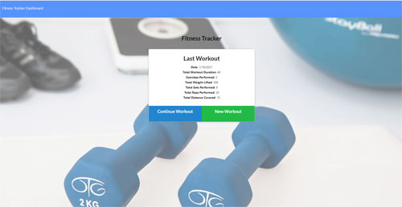

# Workout Tracker


  

---

## 📚 Educational Project

This project was completed as part of University of Arizona Full-Stack Web Development Bootcamp to demonstrate understanding of: **MongoDB database design, Mongoose ODM and schema creation, RESTful API routes with Express, CRUD operations, aggregate methods for data analysis, and full-stack application architecture**.

**Status:** Archived - No longer under active development  
**Purpose:** Portfolio demonstration of MongoDB/Mongoose integration and Express routing  
**Completed:** January 2021

---

## Table of Contents
  * [Description](#description)
  * [User Story](#user-story)
  * [Usage](#usage)
  * [Technology](#technology)
  * [Installation](#installation)
  * [Images / Demo Video](#images--demo-video)
  * [License](#license)
  * [Questions / Contact Details](#questions--contact-details)

---

## Description

Create a workout tracker using a MongoDB database with a Mongoose schema and routes handled with Express. The application allows users to create, track, and view daily workouts with support for both resistance and cardio exercises.

---

## User Story

AS A user  
I WANT to be able to view, create, and track daily workouts  
I WANT to be able to log multiple exercises in a workout on a given day  
I SHOULD be able to track the name, type, weight, sets, reps, and duration of exercise  
IF the exercise is a cardio exercise, I should be able to track my distance traveled

---

## Usage

This is a full-stack workout tracking application featuring:
- Create new workouts with multiple exercises
- Add resistance exercises with weight, sets, reps, and duration
- Add cardio exercises with distance and duration
- View workout summary and statistics
- Track total workout duration
- Dashboard with data visualization showing:
  - Total workout duration over time
  - Total pounds lifted over time
  - Exercise breakdown by type

---

## Technology

* **JavaScript** (57.8%) - Application logic and API routes
* **CSS** (23.4%) - Styling and layout
* **HTML** (18.8%) - Structure and interface

### Backend Technologies:
* **Node.js** - Server-side runtime environment
* **Express.js** - Web application framework and routing
* **MongoDB** - NoSQL database
* **Mongoose** - ODM for MongoDB schema and validation
* **MongoDB Atlas** - Cloud database hosting

---

## Installation

To run this project locally:
```bash
# Clone the repository
git clone [repository-url]

# Install dependencies
npm install

# Run the application
npm start
```

**Note:** This project is no longer deployed but can be run locally for demonstration purposes.

---

## Images / Demo Video

A video demonstration of this application can be found [here](https://youtu.be/WBs3yf6RkR8).

Click the image to launch the video:

[](https://www.youtube.com/watch?v=WBs3yf6RkR8 "Demo Video")

---

## License


Copyright (c) 2021, Theresa Grier.

Permission is hereby granted, free of charge, to any person obtaining a copy of this software and associated documentation files (the "Software"), to deal in the Software without restriction, including without limitation the rights to use, copy, modify, merge, publish, distribute, sublicense, and/or sell copies of the Software, and to permit persons to whom the Software is furnished to do so, subject to the following conditions:

The above copyright notice and this permission notice shall be included in all copies or substantial portions of the Software.

THE SOFTWARE IS PROVIDED "AS IS", WITHOUT WARRANTY OF ANY KIND, EXPRESS OR IMPLIED, INCLUDING BUT NOT LIMITED TO THE WARRANTIES OF MERCHANTABILITY, FITNESS FOR A PARTICULAR PURPOSE AND NONINFRINGEMENT. IN NO EVENT SHALL THE AUTHORS OR COPYRIGHT HOLDERS BE LIABLE FOR ANY CLAIM, DAMAGES OR OTHER LIABILITY, WHETHER IN AN ACTION OF CONTRACT, TORT OR OTHERWISE, ARISING FROM, OUT OF OR IN CONNECTION WITH THE SOFTWARE OR THE USE OR OTHER DEALINGS IN THE SOFTWARE.

---

## Questions / Contact Details

If you have any questions about this project, please visit my GitHub profile at [TreeGee73](https://github.com/TreeGee73).
